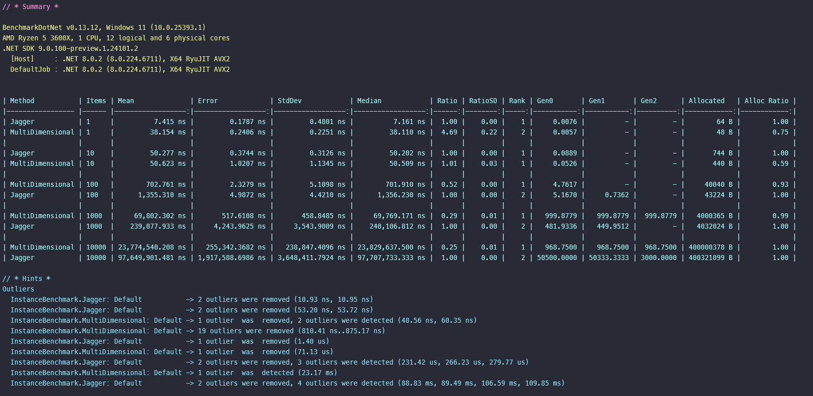
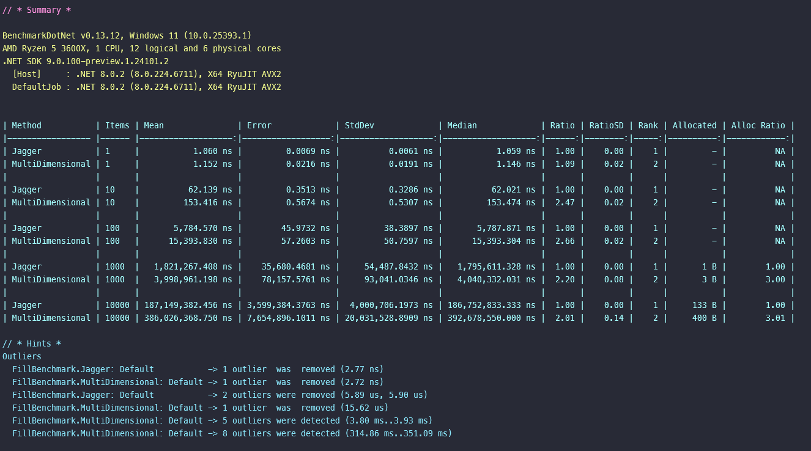
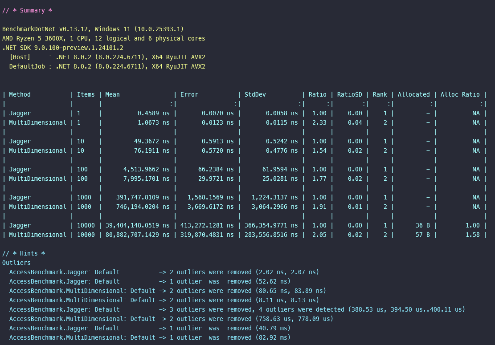

# .NET - Array Jagged vs. Multidimensional

## How to run
```bash
dotnet build -c Release ./src/Benchmarks.csproj
dotnet run -p ./src/Benchmarks.csproj -c Release
```
Or in Windows
```bash
./benchmark.bat
```

## Benchmark Results

### Instanciate


### Fill


### Access

